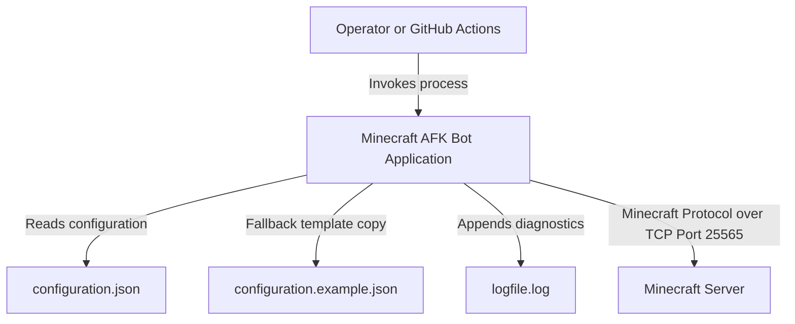
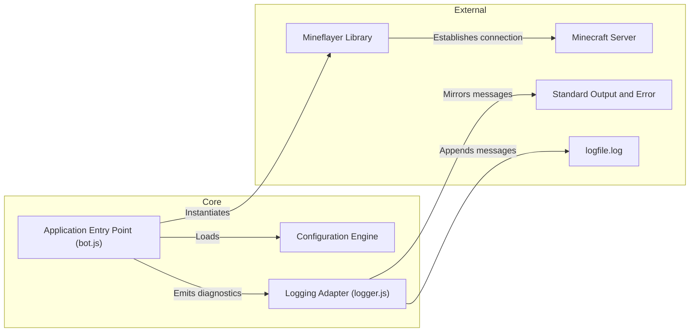
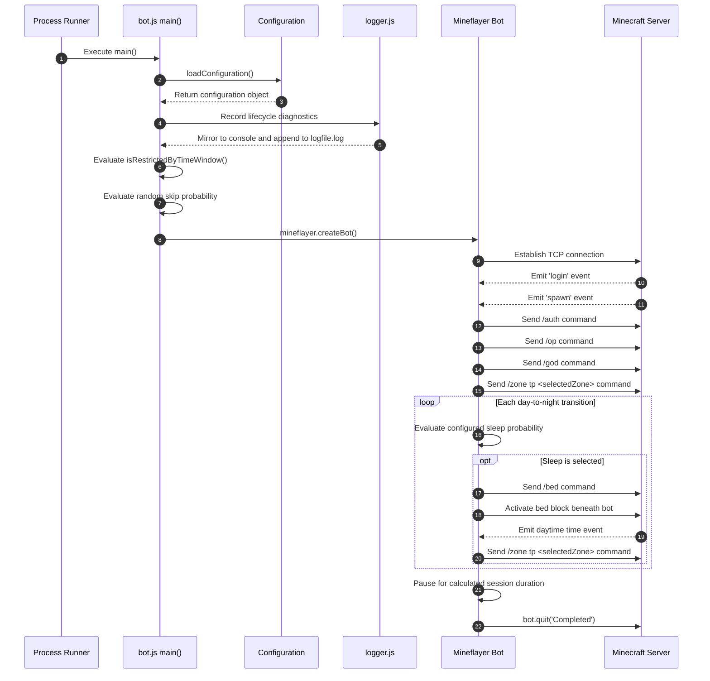
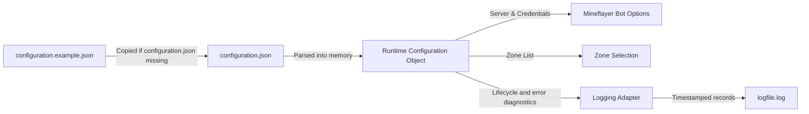
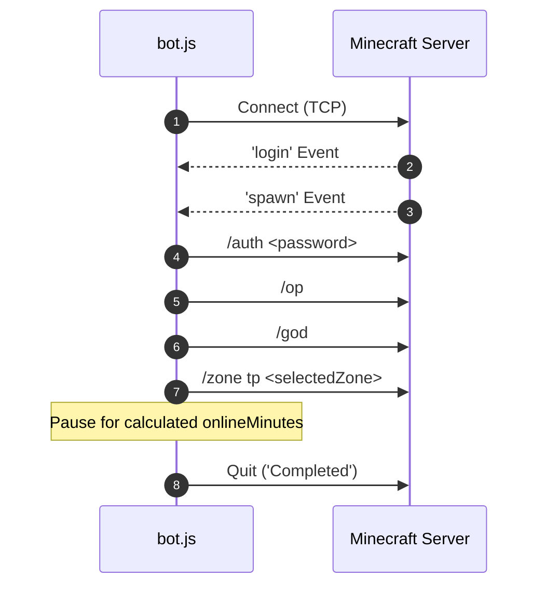
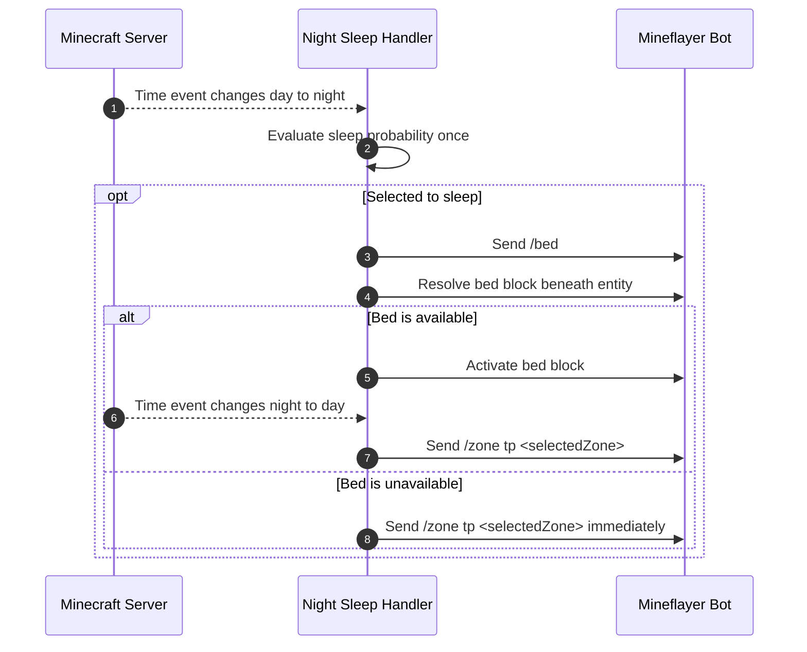
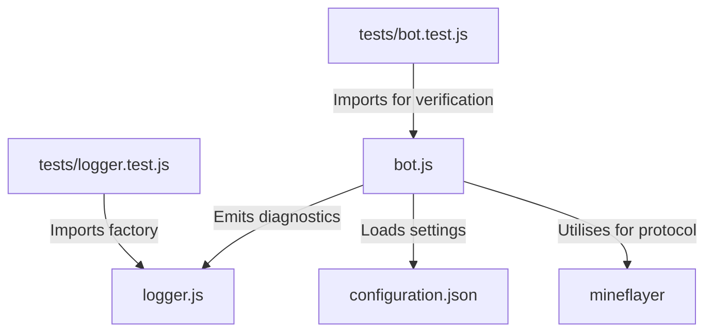

# Minecraft AFK Bot Architecture

This document describes the current architecture, component responsibilities, runtime execution flows, data models, configuration boundaries, and verification strategies for the Minecraft AFK Bot.

## 📑 Table of Contents

- [Purpose](#purpose)
- [System Context](#system-context)
- [Architectural Style](#architectural-style)
- [Runtime Flow](#runtime-flow)
- [Components](#components)
- [Architectural Areas](#architectural-areas)
  - [Application Entry Point](#application-entry-point)
  - [Configuration Management](#configuration-management)
  - [Logging](#logging)
  - [Automated Test Suite](#automated-test-suite)
- [Data Architecture](#data-architecture)
- [Interfaces and Integrations](#interfaces-and-integrations)
- [Key Flows](#key-flows)
  - [Session Lifecycle Flow](#session-lifecycle-flow)
  - [Night Sleep Flow](#night-sleep-flow)
- [Cross-Cutting Concerns](#cross-cutting-concerns)
  - [Security and Privacy](#security-and-privacy)
  - [Error Handling](#error-handling)
  - [Observability](#observability)
  - [Configuration](#configuration)
  - [Concurrency and Resource Use](#concurrency-and-resource-use)
- [Dependency Direction and Rules](#dependency-direction-and-rules)
- [External Dependencies](#external-dependencies)
- [Deployment and Operations](#deployment-and-operations)
- [Compatibility Contracts](#compatibility-contracts)
- [Testing and Verification](#testing-and-verification)
- [Design Constraints](#design-constraints)
- [Extension Points](#extension-points)
  - [Custom Bot Event Handlers](#custom-bot-event-handlers)
- [Architecture Decisions](#architecture-decisions)
- [Source Map](#source-map)
- [Related Documentation](#related-documentation)

## 🎯 Purpose

The Minecraft AFK Bot is a lightweight automation utility constructed to maintain an active player presence across designated zones on a Minecraft server utilizing Mineflayer. This document records the architectural design, component boundaries, execution flows, and system constraints to guide contributors and maintainers.

## 🌐 System Context

The application operates as an independent client process connecting to a remote Minecraft server. It interacts with the local filesystem to load configuration and append diagnostics, while mirroring those diagnostics to standard output and standard error.



The principal external boundaries are:
- **Minecraft Server Boundary:** Communicates with remote server instances via the Minecraft protocol over TCP port 25565 utilizing Mineflayer.
- **Local Filesystem Boundary:** Reads runtime settings from [configuration.json](configuration.json), copies [configuration.example.json](configuration.example.json) when the configuration file is absent, and appends diagnostics to the generated `logfile.log` file.

## 🏗️ Architectural Style

The repository implements a single-process scheduled batch script pattern with an event-driven bot controller. The application lifecycle progresses sequentially through schedule and skip evaluations, connection establishment, spawn event handling, command execution, timed presence, and graceful disconnection.



The principal architecture boundaries are:
- **Configuration Boundary:** Encapsulates settings validation, template generation, and JSON parsing in isolated helper functions.
- **Bot Orchestration Boundary:** Manages Mineflayer event listeners, command execution sequencing, timer pauses, and clean process termination.
- **Observability Boundary:** Formats console arguments, adds timestamps and severity levels, and synchronously appends each diagnostic to `logfile.log`.

## 🔄 Runtime Flow



The principal runtime sequence is:
1. Process initialisation and configuration loading via `loadConfiguration()`.
2. Schedule validation via `isRestrictedByTimeWindow()` to verify the current time does not fall within the restricted execution window.
3. Probability evaluation against `schedule.skipProbability` to determine if the random skip condition triggers.
4. Selection of a target zone via `randomChoice()` from the configured zone array.
5. Bot instantiation via `mineflayer.createBot()`.
6. Event listener registration for `login`, `spawn`, `time`, `kicked`, `error`, and `end` events.
7. Upon the `spawn` event, sequential execution of `/auth`, `/op`, `/god`, and `/zone tp` commands with configured delay intervals.
8. For each day-to-night transition, one probability evaluation determines whether the bot executes `/bed` and activates the bed block beneath it.
9. After a selected sleep attempt, the subsequent night-to-day transition teleports the bot to the selected zone once.
10. Timed presence pause for a random duration between `minimumOnlineMinutes` and `maximumOnlineMinutes`.
11. Session conclusion and graceful disconnect via `bot.quit('Completed')`.

## 🧩 Components

| Component | Responsibility | Principal Dependencies | Lifetime or Ownership |
|-----------|----------------|------------------------|-----------------------|
| `applicationLogger` | Mirrors informational and error diagnostics to the console and appends formatted records to `logfile.log`. | `fs`, `path`, `util` | Process-wide instance owned by [logger.js](logger.js). |
| `loadConfiguration` | Ensures configuration file existence and parses [configuration.json](configuration.json). | `fs`, `path` | Transient function invocation on process startup. |
| `isRestrictedByTimeWindow` | Evaluates whether current date and time fall within the restricted execution window. | Date API | Pure helper function invoked during main execution. |
| `main` | Orchestrates schedule evaluations, bot instantiation, event listeners, command sequences, and teardown. | `mineflayer`, `fs`, `path` | Primary process orchestrator function. |
| `executeCommand` | Dispatches in-game chat commands and pauses for specified delay intervals. | `mineflayer` Bot instance | Asynchronous helper function invoked during session execution. |
| `registerNightSleepHandler` | Detects day and night transitions, evaluates sleep probability, and serialises sleep and return operations. | `mineflayer` time events | One listener per spawned bot session. |
| `activateBedUnderBot` | Resolves and activates the bed block directly beneath the bot. | `mineflayer` block interaction API | Transient invocation during a selected night. |

## 🗂️ Architectural Areas

### Application Entry Point

Paths:
- [bot.js](bot.js)

Responsibilities:
- Contains application orchestration, helper functions, and CLI entry point logic.

Boundary rules:
- Directly imports Node.js core modules (`fs`, `path`) and `mineflayer`.
- Exports helper functions and `main` for automated testing without triggering execution when imported as a module.

### Configuration Management

Paths:
- [configuration.example.json](configuration.example.json)
- [configuration.json](configuration.json)

Responsibilities:
- Defines runtime parameters for server connectivity, authentication credentials, zone lists, time restrictions, and session delays.

Boundary rules:
- [configuration.json](configuration.json) is excluded from version control via [.gitignore](.gitignore) to protect local credentials.
- [configuration.example.json](configuration.example.json) is tracked in version control as a default schema template.

### Logging

Paths:
- [logger.js](logger.js)

Responsibilities:
- Mirrors each application diagnostic to its corresponding console stream.
- Appends timestamped `INFO` and `ERROR` records to `logfile.log` beside [bot.js](bot.js).

Boundary rules:
- Authentication command arguments are redacted by [bot.js](bot.js) before they reach the logger.
- The generated log file is excluded from version control via [.gitignore](.gitignore).

### Automated Test Suite

Paths:
- [tests/bot.test.js](tests/bot.test.js)
- [tests/logger.test.js](tests/logger.test.js)

Responsibilities:
- Verifies helper functions, exception handling, configuration loading, command redaction, dual-destination logging, and main orchestration using mock collaborators.

Boundary rules:
- Utilises Node.js native test runner (`node:test`) and assertion library (`node:assert/strict`).
- Must not connect to live Minecraft servers during unit test execution.

## 💾 Data Architecture

The application uses no database. Configuration and append-only diagnostics are persisted as local files, while session state remains transient in memory.



| Data or Store | Owner | Representation and Storage | Lifecycle or Consistency |
|---------------|-------|----------------------------|--------------------------|
| `configuration.example.json` | Repository | File on disk (JSON format) | Immutable version-controlled template. |
| `configuration.json` | Application Host | File on disk (JSON format) | Local file created on demand or edited by operator. |
| `logfile.log` | [logger.js](logger.js) | Append-only UTF-8 text file beside [bot.js](bot.js) | Created on the first diagnostic and retained until the operator truncates or deletes it. |
| Configuration Object | [bot.js](bot.js) | In-memory JavaScript Object | Created at process startup and discarded at process exit. |
| Night Sleep State | `registerNightSleepHandler` | In-memory transition state and promise sequence | Created after zone teleportation and discarded when the bot session ends. |

## 🔌 Interfaces and Integrations

| Interface or Integration | Direction | Contract | Owner | Failure Semantics |
|--------------------------|-----------|----------|-------|-------------------|
| Minecraft Server TCP | Bidirectional | Minecraft Protocol (Port 25565) | `mineflayer` | Logs error or kick events and terminates process. |
| Chat Commands | Outbound | Minecraft In-Game Commands (`/auth`, `/op`, `/god`, `/zone tp`, `/bed`) | `executeCommand` | Spawn-sequence failures terminate the session; sleep-sequence failures are logged without terminating it. |
| Time Events | Inbound | Mineflayer `time` event and `bot.time.isDay` state | `registerNightSleepHandler` | Invalid time states are ignored; sleep-sequence failures are logged. |
| Local Diagnostic Log | Outbound | UTF-8 text records with timestamp, severity, and formatted message | [logger.js](logger.js) | Synchronous filesystem errors propagate to the caller. |

## 🔀 Key Flows

### Session Lifecycle Flow



The session lifecycle flow executes sequentially after connection establishment. If an exception occurs during the spawn command chain, the exception is caught, logged to standard error, and the process issues `bot.quit('Error')` to ensure clean disconnection.

### Night Sleep Flow



The handler records the preceding day state to suppress duplicate evaluations from repeated time packets. Sleep and zone teleport actions share a promise sequence, preserving command order when time updates arrive during an active interaction. A successful `/bed` dispatch marks a selected-zone teleport as pending. If no bed exists beneath the bot, the handler executes the startup zone teleport command immediately and clears the pending teleport so daybreak does not issue a duplicate command.

## 🧵 Cross-Cutting Concerns

### Security and Privacy

- Server credentials (`username`, `password`) are persisted in [configuration.json](configuration.json) which is ignored by [.gitignore](.gitignore).
- No sensitive credentials or tokens are committed to version control.
- [configuration.example.json](configuration.example.json) contains placeholder values for public inspection.
- `/auth` arguments are replaced with `[REDACTED]` before command diagnostics reach the console or log file.
- Runtime logs can contain server addresses, account usernames, and error details; operators control filesystem access and retention.

### Error Handling

- Errors originating from Mineflayer events (`kicked`, `error`, `end`) are recorded through the shared logger.
- Command execution failures during the spawn sequence trigger a try-catch block, logging the error to standard error and `logfile.log` before invoking `bot.quit('Error')`.
- Helper functions enforce parameter validation and throw explicit `TypeError` or `RangeError` exceptions for invalid arguments.

### Observability

- [logger.js](logger.js) mirrors informational messages to standard output and errors to standard error.
- Every mirrored message is appended synchronously to `logfile.log` with a seven-digit ISO 8601 timestamp and `INFO` or `ERROR` severity.
- Logging has no rotation or retention automation; the operator owns file maintenance.

### Configuration

| Configuration Area | Source | Responsibility | Override or Secret Policy |
|--------------------|--------|----------------|---------------------------|
| Connection & Auth | [configuration.json](configuration.json) | Defines host, port, version, username, and password. | Read from disk; excluded from git tracking. |
| Execution Schedule | [configuration.json](configuration.json) | Controls restricted hours and skip probability. | Operator configurable via local file. |
| Night Sleep | [configuration.json](configuration.json) | Controls the probability of bed usage at each night transition. | Defaults to `0.65` when absent; accepts values from `0.0` through `1.0`. |
| Session Timings | [configuration.json](configuration.json) | Sets spawn delay, command delay, and online duration limits. | Operator configurable via local file. |

### Concurrency and Resource Use

- The application executes as a single-threaded asynchronous Node.js process.
- Night sleep and return operations are serialised through one promise sequence to preserve transition order.
- Only one Minecraft bot instance is maintained per process invocation.
- Memory consumption is minimal (< 100 MB) and process lifetime is bounded by the configured session duration.

## 🧭 Dependency Direction and Rules



The principal dependency rules are:
- [bot.js](bot.js) depends on [logger.js](logger.js), Node.js core modules (`fs`, `path`), and external package `mineflayer`.
- [logger.js](logger.js) owns console and log-file output and has no dependency on bot orchestration.
- [tests/bot.test.js](tests/bot.test.js) imports exported functions from [bot.js](bot.js) for unit testing.
- [tests/logger.test.js](tests/logger.test.js) imports the logger factory and writes only to an isolated temporary directory.
- External dependencies must not import application code.

## 📦 External Dependencies

| Dependency | Responsibility | Integration Boundary | Architectural Consequence |
|------------|----------------|----------------------|---------------------------|
| `mineflayer` | Handles Minecraft protocol communication, packet parsing, and bot event emission. | [bot.js](bot.js) (`createBot`) | Core runtime framework for server interaction. |

## 🚀 Deployment and Operations

| Concern | Current Design | Architectural Consequence |
|---------|----------------|---------------------------|
| Process Topology | Single Node.js CLI process executed on demand or via cron scheduler. | Simple execution model without background daemon requirements. |
| Persistence | Local configuration and append-only diagnostics; no database requirements. | Operators must protect and periodically maintain `configuration.json` and `logfile.log`. |
| Operating System | Cross-platform (Linux, macOS, Windows). | Native execution on any system supporting Node.js v18.0.0 or later. |

## 🛡️ Compatibility Contracts

| Contract | Owner | Invariant | Verification | Change Policy |
|----------|-------|-----------|--------------|---------------|
| Configuration Schema | [configuration.example.json](configuration.example.json) | JSON structure with `server`, `credentials`, `zones`, `schedule`, `sleep`, and `session` keys; omitted `sleep.probability` defaults to `0.65`. | Automated tests ([tests/bot.test.js](tests/bot.test.js)) | Backwards-compatible additions permitted. |
| Exported Functions | [bot.js](bot.js) | Module exports orchestration, configuration, timing, command, and night sleep helpers for automated verification. | Automated tests ([tests/bot.test.js](tests/bot.test.js)) | Existing function signatures must remain stable. |

## ✅ Testing and Verification

Automated testing is implemented utilizing Node.js native test runner (`node:test`) and assertion library (`node:assert/strict`). Tests verify configuration management, helper functions, command redaction, console and file output equivalence, boundary conditions, and mock bot event lifecycle flows.

Execute the principal automated verification with:

```bash
npm test
```

Execute syntax verification with:

```bash
npm run build
```

## ⚠️ Design Constraints

- **Single Session Execution:** Constructed to execute a single AFK session per invocation rather than maintaining a persistent multi-bot pool.
- **Append-Only Logging:** Each message performs a synchronous filesystem append, and the application provides no rotation, size limit, or retention automation.
- **Node.js Runtime Dependency:** Requires Node.js v18.0.0 or later for `node:test` support and modern ES syntax.
- **Protocol Compatibility:** Depends on Mineflayer for Minecraft version protocol support.

## 🔧 Extension Points

### Custom Bot Event Handlers

1. Export or modularise additional event handlers within [bot.js](bot.js).
2. Register event listeners on the `bot` instance created inside `main()`.
3. Add unit tests in [tests/bot.test.js](tests/bot.test.js) to verify event handling logic utilizing mock event emitters.

Extension implementations must preserve non-blocking asynchronous execution and graceful teardown semantics.

## 📝 Architecture Decisions

| Decision | Rationale | Consequence | Record |
|----------|-----------|-------------|--------|
| Extracted Configuration | Prevent hardcoding credentials and server settings in application code. | Enables deployment across environments via [configuration.json](configuration.json). | Documented here |
| Dedicated Logging Adapter | Centralise dual console and file output without coupling formatting and persistence to bot orchestration. | All application diagnostics pass through [logger.js](logger.js), and tests can inject isolated loggers. | Documented here |
| Native Test Runner | Refrain from external testing framework dependencies like Jest or Mocha. | Reduces dependency footprint and leverages Node.js built-in capabilities. | Documented here |

## 🗺️ Source Map

| Area | Path |
|------|------|
| Entry Point & Core Logic | [bot.js](bot.js) |
| Logging | [logger.js](logger.js) |
| Configuration Template | [configuration.example.json](configuration.example.json) |
| Configuration File | [configuration.json](configuration.json) |
| Package Manifest | [package.json](package.json) |
| CI Workflow | [.github/workflows/build.yml](.github/workflows/build.yml) |
| Bot Test Suite | [tests/bot.test.js](tests/bot.test.js) |
| Logger Test Suite | [tests/logger.test.js](tests/logger.test.js) |

## 📚 Related Documentation

- [README.md](./README.md): Project overview, capabilities, usage guidelines, configuration reference, and development instructions.
- [LICENSE](./LICENSE): GNU General Public License v3.0 text.
