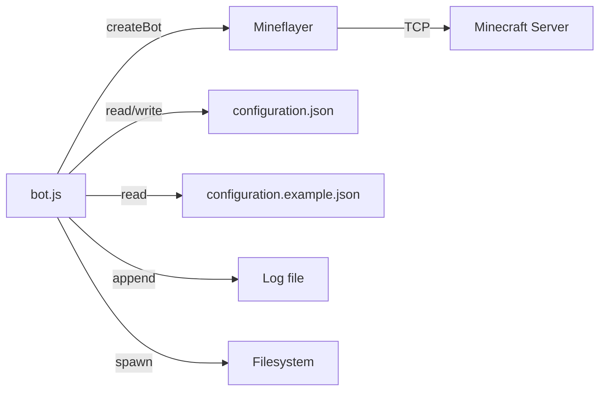

# Components: Integration models

## Overview

This document describes the external interfaces and integration points for the Minecraft AFK Bot.

## Mineflayer bot API

The bot uses `mineflayer.createBot()` to create a Minecraft protocol client.

### Required bot capabilities

| Capability | Used by | Purpose |
|------------|---------|---------|
| `bot.chat(command)` | `executeCommand()` | Send chat commands to server. |
| `bot.blockAt(position)` | `activateBedUnderBot()` | Query block at position. |
| `bot.isABed(block)` | `activateBedUnderBot()` | Check if block is a bed. |
| `bot.activateBlock(block)` | `activateBedUnderBot()` | Activate (right-click) a block. |
| `bot.entity.position` | `activateBedUnderBot()` | Get bot's current position (Vec3). |
| `bot.time.isDay` | `registerNightSleepHandler()` | Check day/night state. |
| `bot.game.dimension` | `registerNightSleepHandler()` | Get current dimension name. |
| `bot.on(event, handler)` | `main()`, `registerNightSleepHandler()` | Register event listeners. |
| `bot.once(event, handler)` | `main()` | Register one-time event listeners. |
| `bot.quit(reason)` | `main()` | Disconnect from server. |

### Events consumed

| Event | Handler | Purpose |
|-------|---------|---------|
| `spawn` | `main()` | Bot entered world; start command sequence. |
| `kicked` | `main()` | Log kick reason. |
| `error` | `main()` | Log connection/protocol errors. |
| `end` | `main()` | Log disconnection; distinguish normal vs error. |
| `time` | `registerNightSleepHandler()` | Detect day/night transitions. |

### Events emitted (by Mineflayer)

The bot does not emit custom events; it only consumes Mineflayer events.

## Minecraft server commands

Commands sent via `bot.chat()`:

| Command | Trigger | Parameters | Expected server response |
|---------|---------|------------|--------------------------|
| `/auth <password>` | Spawn sequence | Password from config | Authentication success. |
| `/op` | Spawn sequence | None | Operator status granted. |
| `/god` | Spawn sequence | None | God mode enabled. |
| `/zone tp <zone>` | Spawn + daybreak | Zone name from config | Teleport to zone. |
| `/bed` | Night sleep | None | Bed interaction initiated. |

### Command assumptions

- Server runs plugins supporting these commands (e.g., AuthMe, Essentials, Zone plugins).
- Commands execute synchronously from bot's perspective.
- No command response parsing; bot assumes success after delay.

## Filesystem integration

### Configuration file

| Path | Operation | Timing |
|------|-----------|--------|
| `configuration.json` | Read (parse JSON) | Startup |
| `configuration.example.json` | Read (copy) | Startup if config missing |
| `configuration.json` | Write (copy template) | Startup if config missing |

### Log file

| Path | Operation | Timing |
|------|-----------|--------|
| `logging.filePath` | Write (append) | Every log call |
| Parent directories | Create (recursive) | First log write if missing |

### Working directory

- All relative paths resolve from directory containing `bot.js`.
- `path.dirname(__filename)` used as base.

## Network integration

### Minecraft protocol

- TCP connection to `server.host:server.port`.
- Protocol version: `server.version` (e.g., `1.20.1`).
- No TLS/SSL (standard Minecraft protocol limitation).
- Authentication: Offline mode or `/auth` command (configured).

### Ports

| Direction | Port | Protocol |
|-----------|------|----------|
| Outbound | `server.port` (default 25565) | TCP (Minecraft) |

## Process integration

### Entry point

```bash
node bot.js
```

### Exit codes

| Code | Meaning |
|------|---------|
| 0 | Normal completion (session finished). |
| 1 | Uncaught exception (config error, validation error, etc.). |
| Signal | Terminated by OS (SIGTERM, SIGINT). |

### Signals

- `SIGINT` (Ctrl+C) → Node.js default: process exits.
- `SIGTERM` → Node.js default: process exits.
- No custom signal handlers registered.

## Environment variables

None required. All configuration via `configuration.json`.

## Integration diagram



## Version compatibility

| Component | Version constraint |
|-----------|-------------------|
| Node.js | ≥ 18.0.0 |
| mineflayer | Compatible with `server.version` |
| Minecraft server | Version matching `server.version` |

## Related documentation

- [Architecture](../architecture.md)
- [Components: Application orchestration](../components/application-orchestration.md)
- [Dependencies](../dependencies.md)
- [Configuration](../configuration.md)
- [Build and deployment](../build-and-deployment.md)