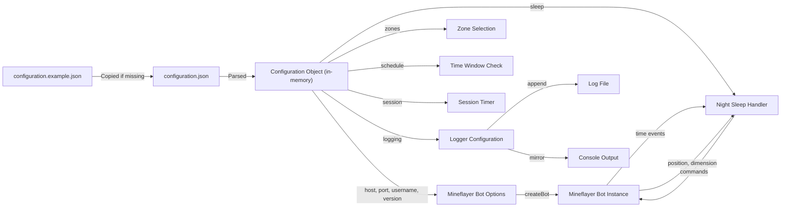

# Data model

## Overview

The application uses no database. All state is either:

- **Persistent** — configuration file and log file on the local filesystem.
- **Transient** — in-memory JavaScript objects during a single process invocation.

## Persistent data

### configuration.json

| Field | Type | Source |
|-------|------|--------|
| `server.host` | string | User-edited |
| `server.port` | number | User-edited |
| `server.version` | string | User-edited |
| `credentials.username` | string | User-edited |
| `credentials.password` | string | User-edited (plaintext) |
| `logging.filePath` | string? | User-edited (optional) |
| `zones` | string[] | User-edited |
| `schedule.startHour` | number | User-edited |
| `schedule.startMinute` | number | User-edited |
| `schedule.endHour` | number | User-edited |
| `schedule.endMinute` | number | User-edited |
| `schedule.skipProbability` | number | User-edited |
| `sleep.probability` | number? | User-edited (optional) |
| `session.minimumOnlineMinutes` | number | User-edited |
| `session.maximumOnlineMinutes` | number | User-edited |
| `session.spawnDelayMilliseconds` | number | User-edited |
| `session.commandDelayMilliseconds` | number | User-edited |

**Lifecycle:**
- Created from `configuration.example.json` template if missing.
- Parsed at process startup via `loadConfiguration()`.
- Discarded at process exit.
- Git-ignored (never committed).

### Log file

| Field | Type | Source |
|-------|------|--------|
| Timestamp | string (ISO 8601, 7-digit fractional seconds) | `logger.js:formatTimestamp()` |
| Level | string (`INFO` or `ERROR`) | `logger.js` |
| Message | string (formatted via `util.format`) | `logger.js` |

**Lifecycle:**
- Append-only.
- Parent directories created automatically.
- No rotation, retention, or archival.
- Operator-managed.

## Transient state

### Configuration object

Created by `loadConfiguration()` at process startup. Passed to `main()` and its helpers. Discarded at process exit.

### Bot instance

Created by `mineflayer.createBot()`. Contains:

| Property | Type | Source |
|----------|------|--------|
| `bot.time.isDay` | boolean | Mineflayer (server time) |
| `bot.time.timeOfDay` | number | Mineflayer (server time) |
| `bot.game.dimension` | string | Mineflayer (server dimension) |
| `bot.entity.position` | object | Mineflayer (player position) |
| `bot.isSleeping` | boolean | Mineflayer (sleep state) |

### Night sleep state

Managed by `registerNightSleepHandler()`:

| Variable | Type | Initial | Purpose |
|----------|------|---------|---------|
| `previousIsDay` | boolean\|null | `bot.time.isDay` or `null` | Detects day/night transitions. |
| `isZoneTeleportPending` | boolean | `false` | Flags owed zone teleport after sleep. |
| `transitionSequence` | Promise | `Promise.resolve()` | Serialises async sleep/teleport operations. |

### Session state

Managed by `main()`:

| Variable | Type | Initial | Purpose |
|----------|------|---------|---------|
| `isCompleted` | boolean | `false` | Prevents duplicate `bot.quit()` calls. |

## Data flow

## External data

| Source | Data | Usage |
|--------|------|-------|
| Minecraft Server | Time, dimension, position, sleep state | Drives night sleep decisions. |
| System clock | Current time | Schedule window evaluation. |
| Filesystem | Configuration, log file | Configuration loading, diagnostic persistence. |

## Data transformations

| Transformation | Location |
|----------------|----------|
| JSON string → configuration object | `loadConfiguration()` |
| `logging.filePath` → resolved path | `resolveLogFilePath()` |
| `sleep.probability` → validated number | `resolveSleepProbability()` |
| `bot.time.isDay` → day/night transition detection | `registerNightSleepHandler()` |
| `bot.game.dimension` → overworld check | `registerNightSleepHandler()` |
| `bot.entity.position` → bed search offsets | `getReachableBedPositions()` |
| `bot.findBlocks()` → bed positions | `getReachableBedPositions()` |
| Command text → redacted form | `redactAuthenticationCommand()` |
| Log values → formatted string | `logger.js:util.format()` |
| Date → ISO 8601 timestamp | `logger.js:formatTimestamp()` |

## Related documentation

- [Architecture](../architecture.md)
- [Components: Application orchestration](../components/application-orchestration.md)
- [Components: Configuration](../components/configuration.md)
- [Configuration schema](../configuration.md)
- [Flows: Session lifecycle](../flows/session-lifecycle.md)
- [Flows: Night sleep](../flows/night-sleep.md)
- [Error handling](../error-handling.md)
- [Testing](../testing.md)
- [Invariants](../invariants.md)