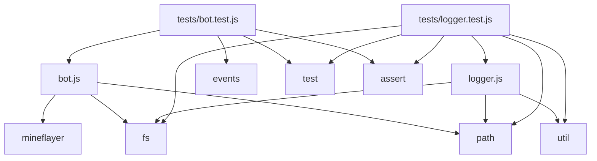

# Dependencies

## External dependencies

| Package | Version | Purpose | Integration boundary |
|---------|---------|---------|---------------------|
| `mineflayer` | ^4.x | Minecraft protocol client, event emission, block interaction, entity management | `bot.js:main()` → `mineflayer.createBot()` |

## Node.js core modules

| Module | Used by | Purpose |
|--------|---------|---------|
| `fs` | `bot.js`, `logger.js` | File I/O (config read, log append, directory creation). |
| `path` | `bot.js`, `logger.js` | Path resolution, directory operations. |
| `util` | `logger.js` | `util.format()` for log message formatting. |
| `events` | `tests/bot.test.js` | `EventEmitter` for mock bot. |
| `test` | `tests/*.test.js` | Native test runner. |
| `assert` | `tests/*.test.js` | Assertions. |

## Dependency graph



## Version constraints

- **Node.js:** ≥ 18.0.0 (required for `node:test`, `node:assert/strict`, modern ES syntax).
- **mineflayer:** Compatible with Minecraft protocol version specified in `configuration.json` (`server.version`).

## Installation

```bash
npm install
```

Installs `mineflayer` and any transitive dependencies.

## Security

- `mineflayer` is a well-maintained, widely-used Minecraft bot library.
- No known vulnerabilities in current version (check `npm audit` periodically).
- No other external dependencies with attack surface.

## Upgrading

1. Update `mineflayer` version in `package.json`.
2. Run `npm install`.
3. Run `npm test` to verify compatibility.
4. Test against target Minecraft server version.

## Related documentation

- [Architecture](../architecture.md)
- [Components: Application orchestration](../components/application-orchestration.md)
- [Build and deployment](../build-and-deployment.md)
- [Testing](../testing.md)