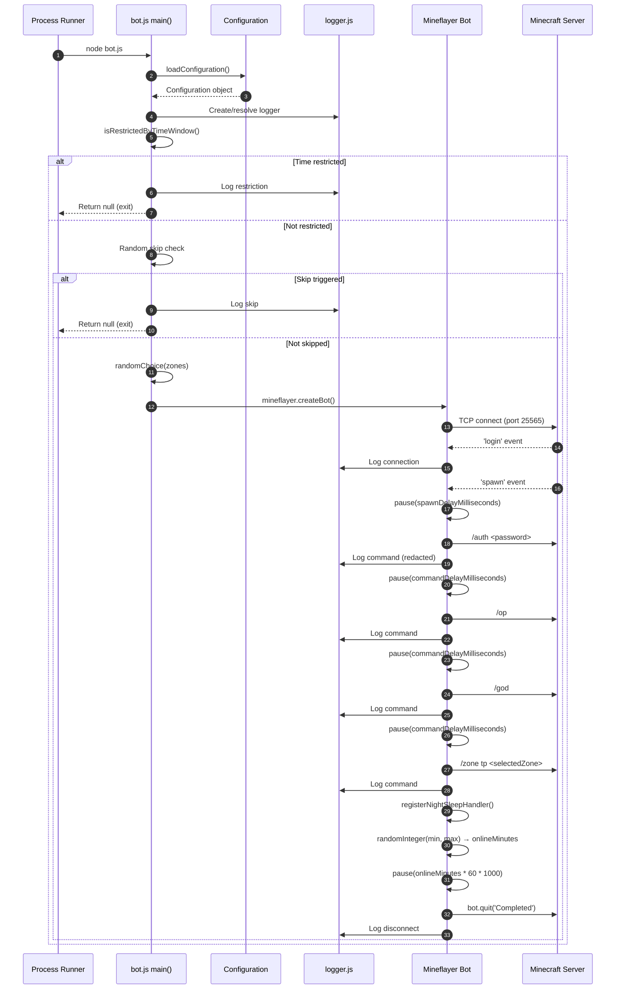

# Session lifecycle flow

## Overview

The session lifecycle is the primary execution path from process start to graceful disconnect. It runs once per invocation.

## Sequence diagram



## Detailed steps

### 1. Configuration loading

```js
const configuration = customConfiguration || loadConfiguration()
```

- `loadConfiguration()` calls `ensureConfigurationExists()` which copies `configuration.example.json` → `configuration.json` if missing.
- Parses JSON; throws on syntax error.

### 2. Logger resolution

```js
const configuredLogFilePath = resolveLogFilePath(configuration.logging)
const activeApplicationLogger = applicationLogger || (
    configuredLogFilePath === DEFAULT_LOG_FILE_PATH
        ? defaultApplicationLogger
        : createLogger({ logFilePath: configuredLogFilePath })
)
```

- Relative paths resolve from `bot.js` directory.
- Parent directories created automatically.

### 3. Time window evaluation

```js
if (isRestrictedByTimeWindow(new Date(), configuration.schedule)) {
    // log and return null
}
```

- Uses local system time.
- Handles overnight windows (e.g., 22:00–06:00).
- `startMinutes === endMinutes` disables restriction.

### 4. Random skip

```js
if (randomSupplier() < configuration.schedule.skipProbability) {
    // log and return null
}
```

- Default `skipProbability: 0.8` (80% chance to skip).
- Uses injected `randomSupplier` (default `Math.random`).

### 5. Zone selection

```js
const selectedZone = randomChoice(configuration.zones)
const zoneTeleportCommand = `/zone tp ${selectedZone}`
```

- Single random selection per session.

### 6. Bot instantiation

```js
const bot = botFactory({
    host: configuration.server.host,
    port: configuration.server.port,
    username: configuration.credentials.username,
    version: configuration.server.version
})
```

- `botFactory` injectable for testing (default `mineflayer.createBot`).

### 7. Event registration

| Event | Handler |
|-------|---------|
| `login` | Log connection details. |
| `spawn` | Execute spawn sequence (async). |
| `kicked` | Log kick reason. |
| `error` | Log error. |
| `end` | Log completion or premature disconnect. |

### 8. Spawn sequence

```js
await pause(configuration.session.spawnDelayMilliseconds)
await executeCommand(bot, `/auth ${configuration.credentials.password}`, commandDelay, logger)
await executeCommand(bot, '/op', commandDelay, logger)
await executeCommand(bot, '/god', commandDelay, logger)
await executeCommand(bot, zoneTeleportCommand, commandDelay, logger)
registerNightSleepHandler(bot, configuration.sleep, commandDelay, zoneTeleportCommand, randomSupplier, logger)
const onlineMinutes = randomInteger(min, max)
await pause(onlineMinutes * 60 * 1000)
isCompleted = true
bot.quit('Completed')
```

- Sequential: each command waits for `commandDelayMilliseconds`.
- `/auth` password redacted in logs.
- `registerNightSleepHandler` sets up day/night transition handling.
- Random online duration between `minimumOnlineMinutes` and `maximumOnlineMinutes`.

### 9. Error handling in spawn

```js
try {
    // spawn sequence
} catch (error) {
    logger.error('An error has occurred during bot execution:', error)
    isCompleted = true
    bot.quit('Error')
}
```

- Any exception triggers error log and `bot.quit('Error')`.

### 10. Disconnect handling

```js
bot.on('end', () => {
    if (!isCompleted) {
        logger.log('Disconnected prior to normal completion.')
    } else {
        logger.log('The bot session has concluded.')
    }
})
```

- Distinguishes graceful vs premature disconnect.

## Error scenarios

| Scenario | Behaviour |
|----------|-----------|
| Config file missing | Copied from template; continues. |
| Config JSON invalid | Throws; process exits with error. |
| Time restricted | Logs; exits cleanly (return null). |
| Random skip triggered | Logs; exits cleanly (return null). |
| Connection fails | `error` event → log → `end` event → log premature disconnect. |
| Authentication fails | Server kicks → `kicked` event → log → `end` event. |
| Spawn command throws | Caught → log → `bot.quit('Error')` → `end` event. |
| Night sleep fails | Logged in handler; promise chain catches; bot continues. |
| Process killed (SIGTERM) | Node.js default; no graceful shutdown hook. |

## Invariants

1. **Exactly one `bot.quit()` call** — `isCompleted` flag prevents duplicates.
2. **Spawn commands execute in order** — each `executeCommand` awaits its delay.
3. **Configuration loaded before bot creation** — no partial initialisation.
4. **Logger resolved before any diagnostics** — all logs go to correct destination.
5. **Zone selected once per session** — not re-selected on daybreak.

## Related documentation

- [Architecture](../architecture.md)
- [Components: Application orchestration](../components/application-orchestration.md)
- [Components: Configuration](../components/configuration.md)
- [Components: Logging](../components/logging.md)
- [Flows: Night sleep](./night-sleep.md)
- [Data model](../data-model.md)
- [Error handling](../error-handling.md)
- [Testing](../testing.md)
- [Invariants](../invariants.md)