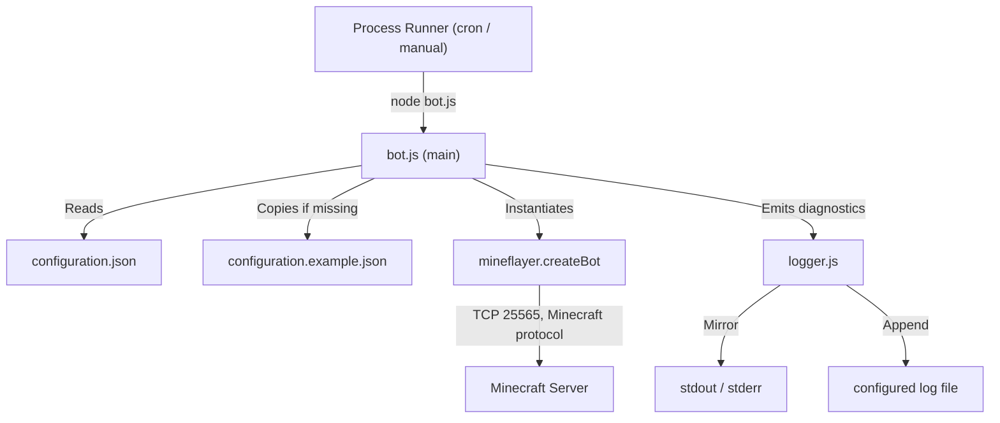

# Repository overview

## Purpose

The Minecraft AFK Bot is a lightweight, single-process automation utility that maintains an active player presence across designated zones on a Minecraft server. It connects via the Mineflayer library, authenticates, teleports to a randomly selected zone, and remains online for a configurable duration. At each day-to-night transition it may use `/bed` to sleep (only when located in the overworld), then teleports back to the selected zone at daybreak.

## Scope

The repository owns:

- Application orchestration and bot lifecycle management (`bot.js`).
- A logging adapter that mirrors diagnostics to the console and appends them to a file (`logger.js`).
- A Node.js native test suite (`tests/bot.test.js`, `tests/logger.test.js`).
- Runtime configuration (`configuration.json`, generated from `configuration.example.json`).

The repository deliberately does **not** own:

- A database or persistent state store.
- A graphical user interface.
- Multi-bot pooling or server-side components.
- Log rotation, retention, or archival automation.

## Entry points

- `node bot.js` — CLI entry point. `main()` runs when `require.main === module`.
- `require('./bot.js')` — imports exported helpers (`main`, `loadConfiguration`, `registerNightSleepHandler`, `activateBedUnderBot`, `executeCommand`, `isRestrictedByTimeWindow`, `resolveSleepProbability`, `pause`, `randomInteger`, `randomChoice`, `resolveLogFilePath`, `ensureConfigurationExists`) for unit testing without executing the bot.

## Runtime topology

## Repository purpose in one paragraph

This repository implements a scheduled, event-driven Mineflayer client that authenticates to a Minecraft server, teleports to a random zone, sleeps at night only in the overworld, and returns to that zone at daybreak, with all behaviour verified by a mock-based unit test suite.

## Root documents

- [ARCHITECTURE.md](../ARCHITECTURE.md) — architectural design, components, flows, and constraints.
- [README.md](../README.md) — user-facing usage, configuration, and setup guide.
- [SECURITY.md](../SECURITY.md) — security model and threat mitigations.
- [LICENSE](../LICENSE) — license terms.

## Documentation

Full documentation lives under [`docs/`](./INDEX.md).
